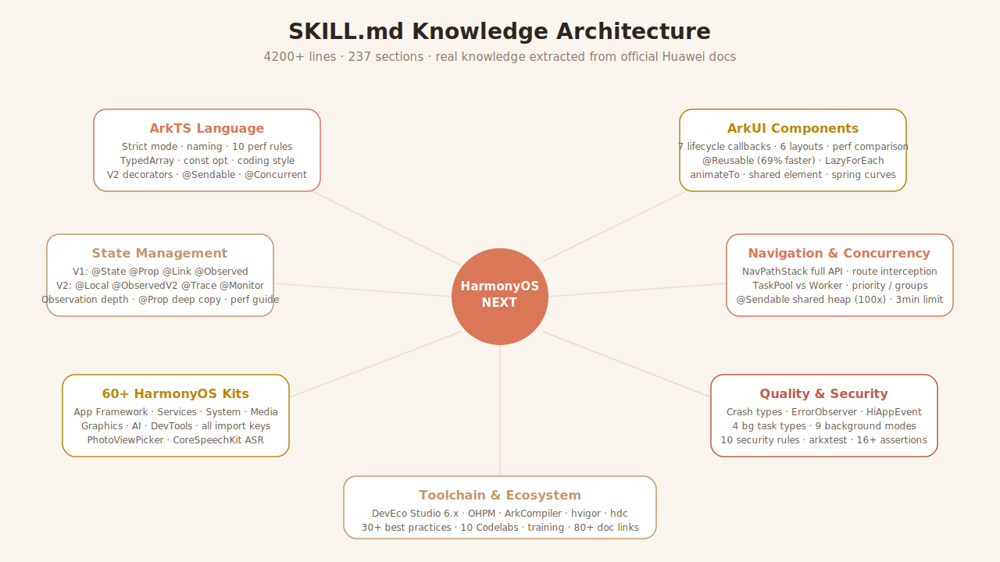

<div align="center">

**English** | [简体中文](./README.md)


# 🧠 HarmonyOS AI Skill

### A HarmonyOS NEXT (鸿蒙) knowledge pack for 11+ AI coding assistants

*"Make your AI write ArkTS / ArkUI like an engineer who's read every Huawei doc."*

[](./LICENSE)
[](https://developer.huawei.com/consumer/cn/)
[](https://developer.huawei.com/consumer/cn/doc/harmonyos-guides-V5/arkts-get-started-V5)
[](#supported-ai-tools)
[](https://agents.md)

[](https://github.com/DengShiyingA/harmonyos-ai-skill/stargazers)
[](https://github.com/DengShiyingA/harmonyos-ai-skill/commits)
[](https://github.com/DengShiyingA/harmonyos-ai-skill/issues)

<br/>

**Ask Cursor to write HarmonyOS — it hands you React.**
**Ask Claude to edit `module.json5` — it writes `package.json`.**
**Ask Copilot about `@ObjectLink` — it says "that API doesn't exist."**

The problem isn't the AI — it's that no one's ever fed it HarmonyOS knowledge.

**So I did. One Markdown source → drop-in configs for 11+ AI tools.**

<br/>

[🚀 Install](#installation) · [📖 What's Inside](#whats-inside-the-knowledge) · [🛠️ Supported Tools](#supported-ai-tools) · [✅ Verify It Works](#verifying-it-works)

</div>

---

<div align="center">

</div>

---

## ⚡ Quick start (Claude Code, 30 seconds)

```bash
git clone https://github.com/DengShiyingA/harmonyos-ai-skill.git ~/src/harmonyos-ai-skill
mkdir -p ~/.claude/skills
ln -s ~/src/harmonyos-ai-skill/harmonyos-development ~/.claude/skills/harmonyos-development
# Restart Claude Code, then ask: "What skills are available?"
```

Using a different tool? See [all install options below](#installation).

---

Write the knowledge once — [`harmonyos-development/SKILL.md`](./harmonyos-development/SKILL.md) — and install it into every major AI coding tool via pre-built drop-in files.

<details>
<summary><b>🤔 What is a "skill"?</b> (click to expand)</summary>

A skill is a chunk of domain knowledge (in Markdown) that an AI coding tool loads as background context when you chat with it. Once installed, the AI "knows" the domain — it will give you HarmonyOS-correct answers instead of generic TypeScript / React advice. Different tools call them different things (skills, rules, instructions, system prompt), but they all work the same way: **extra text prepended to the model's context**.

</details>

**Requirements:** `git` and `curl` (or just copy-paste for web tools). No other dependencies.

## What's inside the knowledge

<div align="center">

</div>

The skill teaches the AI everything needed to read, write, review, and debug HarmonyOS NEXT native apps (~4200 lines of dense, actionable knowledge, 237 sections, 105+ code examples):

- **Language & framework** — ArkTS strictness rules, naming conventions, 13 high-performance coding rules (const, TypedArrays, HashMap, lazy import, etc.), coding style guide
- **App architecture** — Stage model: UIAbility, ExtensionAbility, AbilityStage, WindowStage lifecycles; module.json5 / app.json5 configuration
- **ArkUI components** — component lifecycle (7 callbacks + execution order), layout containers with performance comparison, `@Reusable` component reuse, **Tabs navigation**, **Swiper carousel**, **WaterFlow**, **Grid**, **TextInput**, **AlertDialog/Toast**, 10 form components quick reference, AttributeModifier reusable styles
- **State management** — V1 decorators (`@State`, `@Prop`, `@Link`, `@Provide`/`@Consume`, `@Observed` + `@ObjectLink`, `@Watch`) + V2 decorators (`@ComponentV2`, `@Local`, `@ObservedV2` + `@Trace`, `@Monitor`) + StateStore global state, with observation depth rules, batch update tips, decorator selection priority
- **Navigation** — `Navigation` + `NavPathStack` full API, `Router` basic routing, `App Linking` deep links
- **Animation** — `animateTo()`, `.animation()`, `keyframeAnimateTo()`, Curve enum, spring curves, `geometryTransition` shared element transitions, animation performance tips
- **List operations** — pull-down refresh (Refresh), load-more (onReachEnd), swipe-to-delete (swipeAction), drag reorder, ListItemGroup sticky headers, scroll-to-bottom, maintain scroll position
- **Performance** — `LazyForEach` + IDataSource, `@Reusable`, `cachedCount`, `onVisibleAreaChange`, cold start optimization (lazy import), memory optimization (LRUCache/Purgeable)
- **HarmonyOS Kits** — 60+ Kits across 7 categories with import keys + code examples
- **Kit detailed sections** — Camera Kit, Audio Kit, AVPlayer/AVRecorder, Image Kit (decode/transform/encode), Scan Kit, Account Kit, Payment Kit, Push Kit, Map Kit, Core Vision Kit (OCR/face/segmentation), Form Kit (service cards), AVSession Kit, Location Kit, Notification Kit, Share Kit
- **Data persistence** — relationalStore (SQLite CRUD), preferences (KV storage), fileIo (file R/W), DocumentViewPicker (file picker)
- **Networking** — HTTP requests, WebSocket, network connectivity monitoring, background upload/download (request.agent with resume)
- **Concurrency** — TaskPool vs Worker comparison, `@Concurrent` rules, `@Sendable` shared-heap mechanism
- **System capabilities** — permission request full flow (check→request→settings fallback), immersive window (expandSafeArea), dark mode (resource qualifiers/colorMode), keyboard adaptation (KeyboardAvoidMode), screen orientation, clipboard, custom fonts, desktop shortcuts, gesture conflict resolution (hitTestBehavior/priorityGesture), EventHub, startAbilityByType
- **Web** — ArkWeb component, JS↔ArkTS bridge, cookie management, request interception
- **Cross-device** — app continuation (onContinue/onCreate data migration), cross-module resource access (HAR/HSP)
- **Engineering quality** — security coding rules + network security config (HTTPS/cert pinning), code obfuscation (ArkGuard), arkxtest testing (JsUnit + UiTest), 18 common gotchas
- **Third-party libraries** — @ohos/axios (HTTP client), @ohos/pulltorefresh, @ohos/lottie (JSON animation), @ohos/imageknife (image caching), dayjs (date utils)
- **Latest version support** — HarmonyOS 6.1 (API 23, stable 2026/4) / 6.1.1 (API 24, beta) — Navigation routing stack binding, Menu anchorPosition, UDMF/drag/crypto C APIs, relationalStore sendable enhancement, AI super frame, Camera Kit "Follow the Person" subject tracking, AppStorageV2, PersistenceV2, Weather Service Kit
- **Multi-device** — responsive breakpoints (xs/sm/md/lg/xl), GridRow/GridCol, foldable support
- **Packaging & tooling** — HAP/HSP/HAR, atomic services, DevEco Studio 6.x (hvigor), OHPM, ArkCompiler

---

## Supported AI tools

### 1. Native skill format (auto-invoked by description matching)

| Tool | Install path | How it activates |
|---|---|---|
| **Claude Code CLI** | `~/.claude/skills/harmonyos-development/` | Claude reads `SKILL.md` frontmatter `description` and auto-loads when your question mentions HarmonyOS / ArkTS / ArkUI / Stage model / etc. Zero manual invocation. |
| **Claude Agent SDK** | Put the `harmonyos-development/` folder anywhere, point the SDK at it via the `skills` parameter when constructing the agent | Same as Claude Code — description-based auto-loading. |

### 2. Project rules file (auto-attached to every session inside the project)

| Tool | Install path | Source file | Scope |
|---|---|---|---|
| **Cursor** (modern) | `.cursor/rules/harmonyos.mdc` | `dist/cursor/harmonyos.mdc` | Glob-matched on `*.ets`, `module.json5`, `oh-package.json5`, `build-profile.json5` |
| **Cursor** (legacy) | `.cursorrules` (repo root) | `dist/cursor/.cursorrules` | Always applied |
| **GitHub Copilot** | `.github/copilot-instructions.md` | `dist/copilot/copilot-instructions.md` | Always applied in this repo |
| **Windsurf / Codeium** | `.windsurfrules` (repo root) | `dist/windsurf/.windsurfrules` | Always applied |
| **Continue.dev** | `.continue/rules/harmonyos.md` | `dist/continue/harmonyos.md` | Always applied |
| **Cline / Roo Code** | Settings → Custom Instructions | `dist/cline/custom-instructions.md` | Per-workspace or global |
| **OpenAI Codex CLI · sst/opencode · Amp · Aider · Jules** | `AGENTS.md` (repo root) | `dist/agents-md/AGENTS.md` | Follows the shared [AGENTS.md](https://agents.md) standard |
| **Google Gemini CLI** | `GEMINI.md` (repo root) or `~/.gemini/GEMINI.md` (global) | `dist/gemini-cli/GEMINI.md` | Gemini CLI reads either path |

### 3. Generic — paste into any chat / API

| Tool | Where to paste | Source file |
|---|---|---|
| **ChatGPT / GPT-4 / GPT-5** | Settings → Personalization → Custom Instructions (or per-conversation system prompt) | `dist/plain/harmonyos-knowledge.md` |
| **Google Gemini / AI Studio** | System Instructions field | `dist/plain/harmonyos-knowledge.md` |
| **DeepSeek / Qwen / 文心一言 / Kimi / 智谱** | 系统提示 / 角色设定 field | `dist/plain/harmonyos-knowledge.md` |
| **Ollama local models** | `--system` flag | `dist/system-prompt/system.txt` |
| **Anthropic / OpenAI / any LLM API** | `system` message of your request body | `dist/system-prompt/system.txt` |

The two files differ only slightly: `plain/` is the raw Markdown; `system-prompt/` prepends a short role-framing sentence (*"You are an expert HarmonyOS NEXT developer…"*).

---

## Installation

All `curl` commands below use a shell variable `$RAW` — run this once in your terminal first (it stays set for the rest of your session):

```bash
export RAW=https://raw.githubusercontent.com/DengShiyingA/harmonyos-ai-skill/main
```

### Claude Code CLI

Pick **one** of the three options below:

```bash
# Option A — quick copy (you get a static snapshot)
git clone https://github.com/DengShiyingA/harmonyos-ai-skill.git ~/src/harmonyos-ai-skill
mkdir -p ~/.claude/skills
cp -r ~/src/harmonyos-ai-skill/harmonyos-development ~/.claude/skills/

# Option B — symlink (recommended: auto-updates after `git pull`)
git clone https://github.com/DengShiyingA/harmonyos-ai-skill.git ~/src/harmonyos-ai-skill
mkdir -p ~/.claude/skills
ln -s ~/src/harmonyos-ai-skill/harmonyos-development ~/.claude/skills/harmonyos-development

# Option C — project-local only (commit it so your whole team gets the skill)
cd <your-harmonyos-project>
mkdir -p .claude/skills
cp -r ~/src/harmonyos-ai-skill/harmonyos-development .claude/skills/
```

After installing, **restart Claude Code**. To verify, ask it: *"What skills are available?"* — it should list `harmonyos-development`.

### Cursor

```bash
# Recommended — modern glob-scoped .mdc rule
mkdir -p .cursor/rules
curl -o .cursor/rules/harmonyos.mdc "$RAW/dist/cursor/harmonyos.mdc"

# OR legacy single-file rules (if your Cursor version predates .mdc)
curl -o .cursorrules "$RAW/dist/cursor/.cursorrules"
```

The `.mdc` rule auto-activates only when you edit `.ets`, `module.json5`, etc., keeping context lean for non-HarmonyOS projects.

### GitHub Copilot

```bash
mkdir -p .github
curl -o .github/copilot-instructions.md "$RAW/dist/copilot/copilot-instructions.md"
```

Applies to Copilot Chat and inline suggestions whenever you're inside this repo. Commit it — your whole team benefits.

### Windsurf / Codeium

```bash
curl -o .windsurfrules "$RAW/dist/windsurf/.windsurfrules"
```

### Continue.dev

```bash
mkdir -p .continue/rules
curl -o .continue/rules/harmonyos.md "$RAW/dist/continue/harmonyos.md"
```

### Cline / Roo Code

1. Download the file: `curl -o harmonyos-instructions.md "$RAW/dist/cline/custom-instructions.md"`
2. In VS Code: open Cline / Roo settings → **Custom Instructions**
3. Paste the file contents into the workspace or global instructions field

### AGENTS.md standard (Codex CLI, opencode, Amp, Aider, Jules)

A single file at the repo root serves **every** tool that follows the [AGENTS.md standard](https://agents.md):

```bash
curl -o AGENTS.md "$RAW/dist/agents-md/AGENTS.md"
```

For user-level (global) scope, each tool reads a different path:

| Tool | Global path |
|---|---|
| OpenAI Codex CLI | `~/.codex/AGENTS.md` |
| sst/opencode | `~/.config/opencode/AGENTS.md` |
| Amp | `~/.config/amp/AGENTS.md` |
| Aider | uses `AGENTS.md` from current directory only |

Some tools layer multiple `AGENTS.md` files (nearest one wins / merged). Check each tool's docs.

### Google Gemini CLI

```bash
# Project-level (takes precedence):
curl -o GEMINI.md "$RAW/dist/gemini-cli/GEMINI.md"

# Global (applies to every Gemini CLI session):
mkdir -p ~/.gemini
curl -o ~/.gemini/GEMINI.md "$RAW/dist/gemini-cli/GEMINI.md"
```

### ChatGPT / Gemini web / DeepSeek / Qwen / Kimi / 文心一言

1. Open [`dist/plain/harmonyos-knowledge.md`](./dist/plain/harmonyos-knowledge.md) on GitHub
2. Click **Raw** → **Ctrl/Cmd + A** → **Ctrl/Cmd + C**
3. In your AI tool:
   - **ChatGPT:** Settings → Personalization → **Custom Instructions** → "How would you like ChatGPT to respond?" → paste
   - **Gemini web:** Start a new chat → enable **System Instructions** → paste
   - **DeepSeek / Qwen / 文心一言 / Kimi:** create a new "智能体" / "角色" / "Bot" → paste into system prompt
4. Start asking HarmonyOS questions — the model now has the knowledge loaded

### Ollama / local LLMs

```bash
# Pull any capable model first
ollama pull qwen2.5-coder:14b

# Launch with HarmonyOS system prompt baked in
ollama run qwen2.5-coder:14b \
  --system "$(curl -s $RAW/dist/system-prompt/system.txt)"
```

Or bake it into a custom Modelfile:

```bash
# 1. Download the system prompt
curl -o system.txt "$RAW/dist/system-prompt/system.txt"

# 2. Create a Modelfile (replace the SYSTEM block contents with the file you just downloaded)
cat > Modelfile <<EOF
FROM qwen2.5-coder:14b
SYSTEM """
$(cat system.txt)
"""
EOF

# 3. Register the custom model
ollama create harmonyos-coder -f Modelfile
ollama run harmonyos-coder
```

### Anthropic / OpenAI / any LLM API

```python
# Python example
import anthropic
client = anthropic.Anthropic()

with open("dist/system-prompt/system.txt") as f:
    system_prompt = f.read()

response = client.messages.create(
    model="claude-opus-4-6",
    system=system_prompt,
    max_tokens=2048,
    messages=[{"role": "user", "content": "How do I make a service card in HarmonyOS?"}],
)
```

---

## How activation differs by tool

| Tool category | Trigger mechanism | Always on? |
|---|---|---|
| **Claude Code / Agent SDK** | LLM reads skill `description` and decides whether to load for this turn | No — on-demand, saves context |
| **Cursor `.mdc`** | Glob pattern matches current file | Scoped to `.ets` / HarmonyOS config files |
| **Cursor `.cursorrules`, `.windsurfrules`, Copilot instructions, AGENTS.md, GEMINI.md, Continue / Cline rules** | Always prepended to every turn inside the project | Yes |
| **ChatGPT / Gemini Custom Instructions** | Always prepended to every conversation for that account | Yes |
| **Per-conversation paste / API `system`** | Only the conversations where you paste | Per-call |

**Rule of thumb:** for HarmonyOS-only projects, use the "always-on" rule files. For mixed repos (e.g. you have both Android and HarmonyOS code), prefer Cursor's scoped `.mdc` or Claude Code's description-based loading.

---

## Verifying it works

Ask the AI:

> *"Explain `@ObjectLink` in ArkUI and when to use it instead of `@State`."*

The answer is **properly primed** if it mentions:

- ✅ You must mark the class with `@Observed` for `@ObjectLink` to work
- ✅ `@State` on an array of objects only reacts to array mutations (push/splice/reassign), not per-item property changes
- ✅ Wrap items with `@Observed` + use `@ObjectLink` in the row component
- ✅ Or reassign the whole object to trigger a rerender

If the answer is vague or generic TS / React-like ("use a state hook"), the knowledge is **not loaded**.

Other good probes:

- "What's the difference between FA model and Stage model?"
- "How do I declare and request runtime permissions in HarmonyOS?"
- "Which Kit do I use for HTTP requests?"
- "How do I build a service card (服务卡片)?"

---

## Repository layout

```
harmonyos-ai-skill/
├─ .gitignore
├─ LICENSE
├─ README_EN.md
├─ harmonyos-development/
│  └─ SKILL.md                          ← Source of truth. Edit only here.
├─ scripts/
│  └─ build-dist.sh                     ← Regenerates every dist/ file
├─ dist/                                ← Generated — do not edit by hand
│  ├─ claude-code/harmonyos-development/SKILL.md
│  ├─ cursor/harmonyos.mdc
│  ├─ cursor/.cursorrules
│  ├─ copilot/copilot-instructions.md
│  ├─ windsurf/.windsurfrules
│  ├─ continue/harmonyos.md
│  ├─ cline/custom-instructions.md
│  ├─ agents-md/AGENTS.md
│  ├─ gemini-cli/GEMINI.md
│  ├─ plain/harmonyos-knowledge.md
│  └─ system-prompt/system.txt
└─ README.md
```

**Single-source workflow:**

1. Edit `harmonyos-development/SKILL.md`
2. Run `./scripts/build-dist.sh`
3. Commit both the source and the regenerated `dist/`

---

## Updating to the latest version

```bash
cd /path/to/your/clone
git pull
./scripts/build-dist.sh
# then re-copy whichever file your tool reads
```

If you installed via `ln -s`, you only need `git pull` — the symlink picks up changes automatically.

---

## Authoring your own skill

The source format is Claude Code's `SKILL.md` — YAML frontmatter plus a Markdown body:

```markdown
---
name: my-skill-name
description: >
  First sentence: what domain this skill covers.
  Then an exhaustive list of trigger phrases the AI might match:
  keywords, API names, command names, user questions, synonyms.
---

# My Skill

## When to apply this skill
- Bullet list of concrete scenarios

## Reference
Dense, cite-able reference material: tables, code snippets, API signatures,
rules, gotchas. Avoid prose filler. Favour bullets and compact examples.
```

### Guidelines

- **Focused** — one domain per skill. Don't combine HarmonyOS + iOS + Android.
- **Dense** — cut every sentence that doesn't teach the AI something it can cite.
- **Trigger-rich** — list every plausible user phrasing in `description`, in English and Chinese if relevant. The LLM's matching is fuzzy but benefits from explicit keywords.
- **Actionable** — prefer concrete code/config snippets over abstract explanations.
- **Honest about gaps** — if a feature is deprecated, say so. If you don't have data, leave it out.

After editing the source file, run `./scripts/build-dist.sh` to regenerate every tool-specific drop-in under `dist/`.

---

## Troubleshooting

**The AI still gives generic TypeScript/React answers.**
- Confirm the file landed in the right path (see table in *Supported AI tools*).
- For Claude Code, run *"What skills are available?"* — if `harmonyos-development` isn't listed, restart Claude Code or check `~/.claude/skills/` directly.
- For project-rule tools (Cursor, Copilot, etc.), make sure you're editing files **inside the repo** where the rule file lives. Rules don't apply outside the repo.
- For paste-based tools (ChatGPT, DeepSeek, …), the system prompt is per-conversation; start a **new chat** after pasting.

**Rule file is too long for the tool's context limit.**
Unlikely — `SKILL.md` is ~4200 lines (~150 KB). All major AI tools (Claude/GPT-4/Gemini etc.) accept it. If you hit a limit (e.g. some local small models), trim sections from `dist/plain/harmonyos-knowledge.md` manually.

**`curl` fails with 404.**
The branch in the URL may have moved. Check `https://github.com/DengShiyingA/harmonyos-ai-skill/branches` and update `$RAW` accordingly.

**How do I update after the upstream repo changes?**
See the *Updating to the latest version* section above.

---

## License & contributing

Licensed under the **MIT License** — use it freely in personal and commercial projects.

Contributions welcome:
1. Fork the repo
2. Edit `harmonyos-development/SKILL.md` (the **only** file you should ever edit — `dist/` is generated)
3. Run `./scripts/build-dist.sh` to regenerate distribution files
4. Commit both the source and the regenerated `dist/`, then open a PR

Factual corrections, new gotchas, updated API names, and translations of the description field (for better trigger matching) are all welcome.
